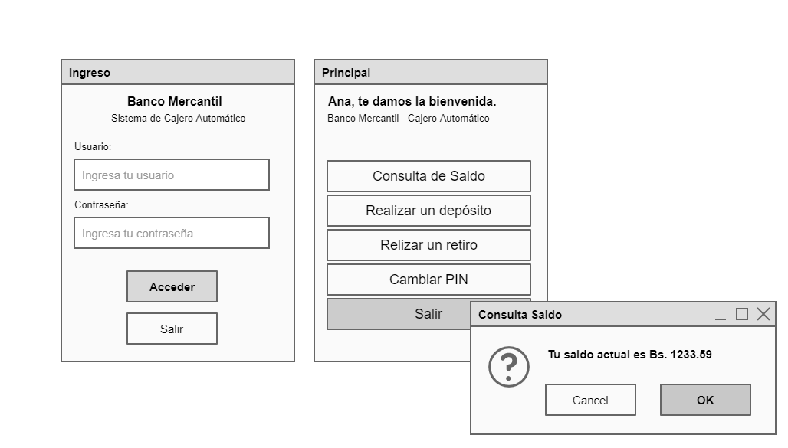
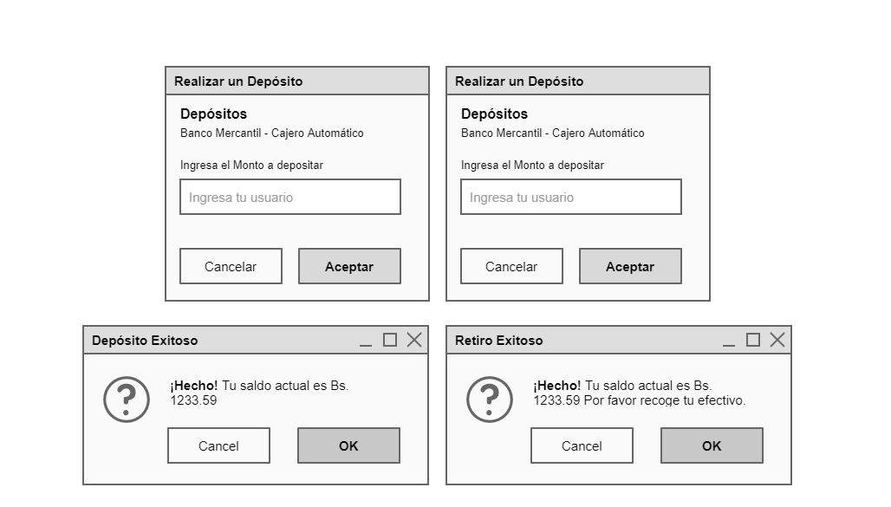
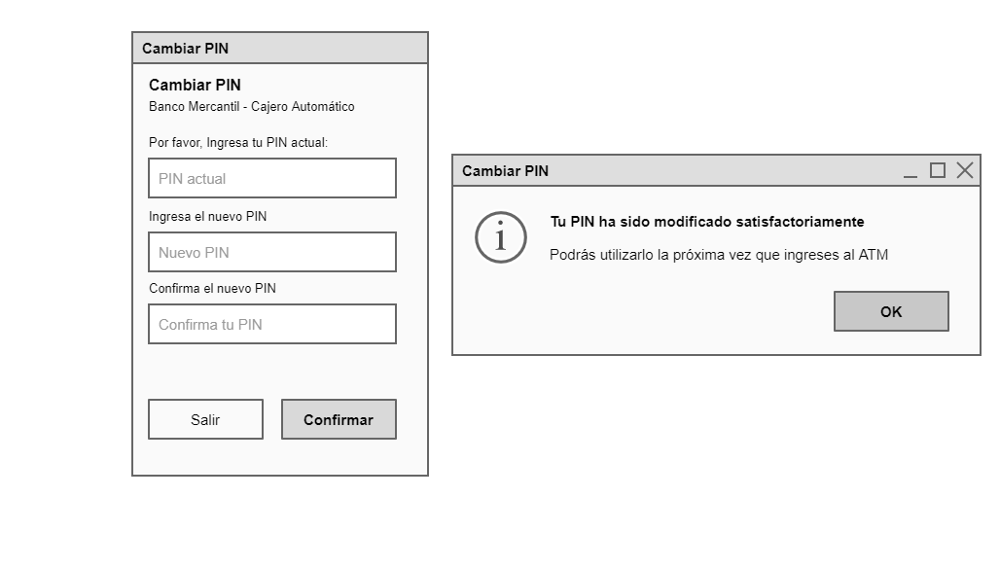

# Ejemplo de Cajero Automático como si fuera Mainframe.

## Funcionalidad

**Práctica de Línea de Comandos: Simulación de un Cajero Automático**

**Objetivo:**  
Desarrollar un programa interactivo en línea de comandos que simule las operaciones básicas de un cajero automático.

**Instrucciones:**

1. **Inicialización del Programa**:
    * Al iniciar el programa, se debe solicitar al usuario que ingrese un PIN (Número de Identificación Personal) de 4 dígitos.
    * Si el PIN es incorrecto después de 3 intentos, el programa debe cerrarse con un mensaje de error.
    * Si el PIN es correcto, el usuario puede acceder al menú principal.

2. **Menú Principal**:
    * El menú principal debe ofrecer las siguientes opciones:
        1. Consultar saldo.
        2. Realizar un depósito.
        3. Realizar un retiro.
        4. Cambiar PIN.
        5. Salir.

3. **Consultar Saldo**:
    * Mostrar el saldo actual del usuario.

4. **Realizar un Depósito**:
    * Solicitar al usuario que ingrese la cantidad que desea depositar.
    * Validar que la cantidad sea positiva.
    * Añadir la cantidad al saldo actual.
    * Mostrar un mensaje de confirmación.

5. **Realizar un Retiro**:
    * Solicitar al usuario que ingrese la cantidad que desea retirar.
    * Validar que la cantidad sea positiva y que no exceda el saldo actual.
    * Restar la cantidad del saldo actual.
    * Mostrar un mensaje de confirmación.

6. **Cambiar PIN**:
    * Solicitar al usuario que ingrese su PIN actual.
    * Si el PIN ingresado es correcto, pedir que ingrese el nuevo PIN.
    * Solicitar que confirme el nuevo PIN ingresándolo nuevamente.
    * Si ambos PINs coinciden, actualizar el PIN.

7. **Salir**:
    * Mostrar un mensaje de despedida y cerrar el programa.


## Requerimientos

Para correr este proyecto debe tener instalado:

 - Java 11
 - Maven 3.8.4

Se recomienda utilizar sdkman (Linux)

## Compilación

Para compilar el proyecto

```
mvn clean install
```

## Ejecución

```
mvn exec:java -Dexec.mainClass="bo.edu.ucb.sis213.App"
```

## Instalación de la Base de Datos

1. Hacer correr una instancia MySQL en docker

```
docker run --name mysql-atm -e MYSQL_ROOT_PASSWORD=123456 -p 3306:3306 -d mysql:8
```

2. Me conecto a la BBDD (Le pedira password es 123456)

```
docker exec -it mysql-atm mysql -u root -p
```

3. Creamos la Base de Datos del ATM.

```
CREATE DATABASE atm;
```

4. Creamos la Base de Datos del ATM.

```
use atm;
```

5. Ejecutan el script init.sql de la carpeta database.


## Maquetado de interfaz gráfica








